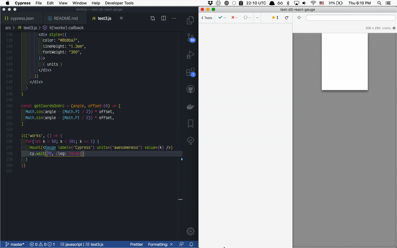

# test-d3-react-gauge

 

Testing gauges explained in this visually stunning blog post [Creating a Gauge in React](https://wattenberger.com/blog/gauge)

Testing using [cypress-react-unit-test](https://github.com/bahmutov/cypress-react-unit-test)

See tests in [src](src) folder

